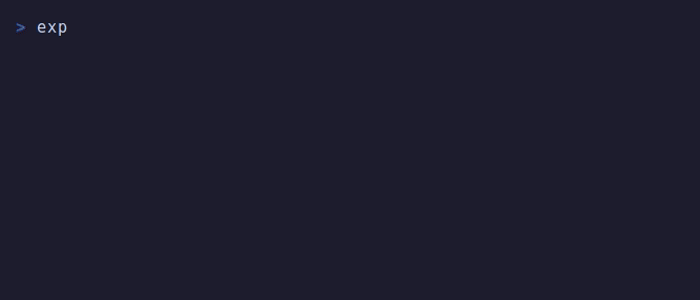

<p align="center">
  
</p>

<h1 align="center">deploy-once</h1>
<p align="center">A URL that works exactly once, then self-destructs.</p>

<p align="center">
  <a href="https://www.npmjs.com/package/@lorb/deploy-once"><code>npm install @lorb/deploy-once</code></a>
</p>

<p align="center">
  
</p>

**One visit.** First person to open the link sees your site. Everyone after gets `410 Gone`. No cleanup, no lingering deployments.

**Public URL.** A Cloudflare tunnel gives you a shareable `https://` URL — no account needed, no DNS setup.

**Self-destruct.** After the visit (or when the TTL expires), the process exits. Nothing left running.

```bash
$ npx @lorb/deploy-once ./dist

  deploy-once
  URL: https://random-words.trycloudflare.com
  Waiting for visitor... (expires in 24h)

  Visited! Shutting down.
```

## Install

```bash
npm install -g @lorb/deploy-once
```

Or run directly with `npx`:

```bash
npx @lorb/deploy-once ./dist
```

## What you can do

### Share a preview for code review

```bash
deploy-once ./dist --message "PR #42 preview"
```

Send the URL in Slack. Reviewer opens it, sees the site, done. The link dies after.

### Send a disposable demo

```bash
deploy-once ./dist --ttl 1h
```

One-hour window. If nobody visits, it shuts down automatically.

### Serve a single HTML file

```bash
deploy-once index.html
```

Single files must be `.html`. For other file types, put them in a directory.

### Pipe the URL into another command

URL goes to stdout, everything else to stderr. Pipe-friendly.

```bash
url=$(deploy-once ./dist 2>/dev/null)
echo "Send this to the client: $url"
```

### Use without a tunnel (local only)

```bash
deploy-once ./dist --local
# Serves on localhost only — no public URL
```

### Use programmatically

```js
import { createOneShotServer } from '@lorb/deploy-once';

const server = await createOneShotServer({
  path: './dist',
  ttlMs: 60 * 60 * 1000,
});

console.log(server.url);    // https://....trycloudflare.com
console.log(server.port);   // local port

server.events.on('visited', ({ time, ip }) => {
  console.log(`Visited from ${ip}`);
});

const reason = await server.done; // 'visited' | 'ttl'
```

## Prerequisites

Public URLs require [`cloudflared`](https://developers.cloudflare.com/cloudflare-one/connections/connect-networks/downloads/) installed. No Cloudflare account needed — it uses [Quick Tunnels](https://developers.cloudflare.com/cloudflare-one/connections/connect-networks/do-more-with-tunnels/trycloudflare/).

Use `--local` to skip this requirement.

## Options

```
deploy-once <path> [options]

--ttl <duration>   Auto-expire (default: 24h). Examples: 30m, 1h, 6h
--message <text>   Display in terminal when someone visits
--local            Skip tunnel, localhost only
-h, --help         Show help
```

## License

𖦹 MIT — [Lorb.studio](https://lorb.studio)
